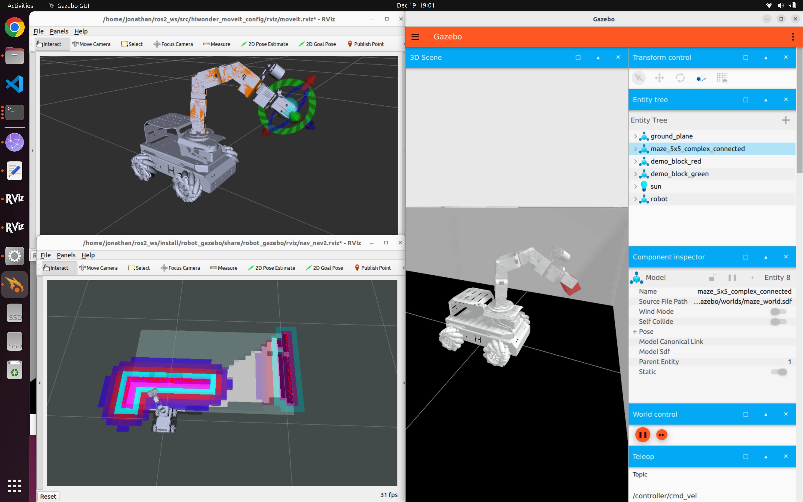
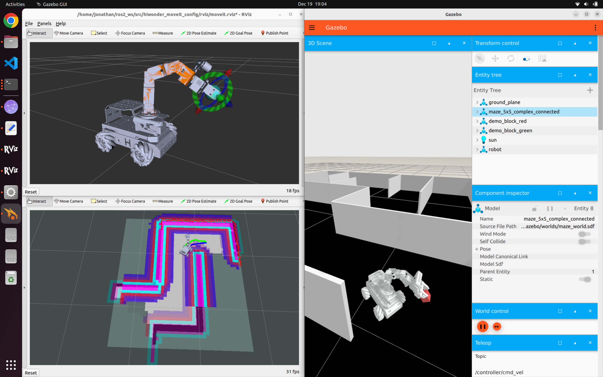

# ros2_humble_landerpi

This repository assumes you first install Ubuntu 22.04 (Jammy), then use the provided scripts to install ROS2 Humble, Gazebo (Fortress), and the LanderPi model/examples. It ships a ready-to-use ROS2 Humble workspace covering the robot, navigation/SLAM stacks, arm control, and perception demos. The scripts install ROS2, dependencies, copy the workspace to `~/ros2_ws`, and build it.

## Install flow

1) Clone this repo (contains the install scripts and the `ros2_ws` workspace):
```bash
git clone https://github.com/jonaloo19/ros2_humble_landerpi.git
cd ros2_humble_landerpi
```

2) Install ROS 2 Humble (skips if already present):
```bash
chmod +x install_ros2_humble.sh
./install_ros2_humble.sh
```

3) Install dependencies, copy the workspace to `~/ros2_ws`, and build:
```bash
chmod +x install_gazebo_landerpi.sh
./install_gazebo_landerpi.sh
```
This script:
- Installs:
  - Build tools: `python3-colcon-common-extensions`
  - Gazebo/ROS bridge: `ros-humble-ros-gz`, `ros-humble-ros-ign-gazebo`, `ros-humble-ros-ign-bridge`, `ros-humble-gz-ros2-control`
  - Controllers/nav stack pieces: `ros-humble-controller-manager`, `ros-humble-ros2-control`, `ros-humble-ros2-controllers`, `ros-humble-nav2-costmap-2d`, `ros-humble-dwb-critics`, `ros-humble-dwb-core`, `ros-humble-dwb-plugins`
  - Nav bringup: `ros-humble-navigation2`, `ros-humble-nav2-bringup`
  - SLAM: `ros-humble-cartographer`, `ros-humble-cartographer-ros`, `ros-humble-slam-toolbox`
  - Motion planning: `ros-humble-moveit`
  - Utility: `ros-humble-joint-state-publisher`, `ros-humble-joint-state-publisher-gui`, `tmux`
  - Math libs: `libnlopt-dev`, `libnlopt-cxx-dev`, `libsuitesparse-dev`, `liblapack-dev`, `libblas-dev`, `ros-humble-lib2go`
  - System: `rsync`, `lsb-release`
- Copies the bundled `ros2_ws` from this repo into `~/ros2_ws` (renames any existing `~/ros2_ws` with a timestamp).
- Builds the workspace with `colcon build --symlink-install` (runs twice).
- Updates `~/.bashrc` to source `~/ros2_ws/install/setup.bash` and sets `IGN_GAZEBO_RESOURCE_PATH` for meshes.
- Adds commented CPU-render fallbacks for Gazebo in case GPU drivers are an issue.

After running, open a new terminal (or `source ~/.bashrc`) to load the environment.

## Workspace highlights (`ros2_ws/src`)
- Simulation & robot model: `robot_gazebo`, `landerpi_description`, `landerpi_arm`, `holonomic_sim`.
- Control & interfaces: `driver/*`, `landerpi_interfaces`, `interfaces`, `gz_ros2_control`, `trac_ik`.
- Navigation & exploration: `navigation`, `slam`, `costmap_converter`, `m-explore-ros2`, `Autonomous-Explorer-and-Mapper-ros2-nav2`, `multi`, `peripherals`.
- Perception & demos: `app`, `example`, `color_detection`, `yolov8_detect`.
- Manipulation & planners: `hiwonder_moveit_config`, `teb_local_planner`.
- LLM + examples: `large_models`, `large_models_examples` (configure API keys).
- Bringup & hardware: `bringup`, `calibration`, `ldlidar_stl_ros2`, `xf_mic_asr_offline`, `xf_mic_asr_offline_msgs`.

## Running quick checks
Without tmux (separate terminals):
```bash
ros2 launch robot_gazebo room_worlds.launch.py      # world + robot
ros2 launch robot_gazebo slam.launch.py             # RVIZ with SLAM
ros2 run robot_gazebo teleop_key_control            # optional teleop
```
With tmux helper:
```bash
tmux new-session \; \
  send-keys "ros2 launch robot_gazebo room_worlds.launch.py" C-m \; \
  split-window -h \; \
  send-keys "ros2 launch robot_gazebo slam.launch.py" C-m \; \
  split-window -h \; \
  send-keys "ros2 run robot_gazebo teleop_key_control" C-m
```

## Running SLAM, Navigation and Manipulation with RGB-D Camera
This sequence launches the Gazebo maze world, starts SLAM and navigation with simulated time and a custom Nav2 config, then brings up RGB-D perception and arm manipulation in Gazebo. Use the color pick executor to attempt grasping and the frontier explorer to keep mapping; rerun the pick step if a grasp fails.

# Gazebo
Launches the Gazebo world with the LanderPi model (maze world), with navigation nodes disabled.
```bash
ros2 launch robot_gazebo worlds.launch.py world_name:=maze_world nav:=false
```

# SLAM
Starts the SLAM pipeline using simulated time to build a map in Gazebo.
```bash
ros2 launch robot_gazebo slam.launch.py use_sim_time:=true
```
# Navigation
Launches the navigation stack with exploration parameters using simulated time and a custom Nav2 params file.
```bash
ros2 launch robot_gazebo navigation_exploration.launch.py \
  use_sim_time:=true \
  params_file:=ros2_ws/src/robot_gazebo/config/nav2_params_exploration.yaml \
  publish_robot_description:=false
```

# Camera (RGB+D)
Runs the RGB-D color detection node.
```bash
ros2 run color_detection multi_color_detector_with_depth
```
# Moveit Controller
Launches MoveIt in Gazebo with simulated time for arm planning/execution.
```bash
ros2 launch hiwonder_moveit_config demo.launch.py use_gazebo:=true use_sim_time:=true
```

# LanderPi arm control
Starts the arm bringup stack for the LanderPi arm.
```bash
ros2 launch landerpi_arm arm_bringup.launch.py
```
# LanderPi Arm Manipulation Application - Colour Picking
Runs the color-based pick-and-place executor; rerun if the grasp fails.
```bash
ros2 run landerpi_arm color_pick_executor --ros-args -p use_sim_time:=true -p cruise_joints:="[0.35,-0.42,-0.96,-1.57,-1.54]" -p skip_home:=false -p color_priority:="['GREEN','RED','BLUE','YELLOW']" -p z_min:=0.035 -p dz_grasp:=0.00 -p dx_grasp:=-0.02 -p dy_grasp:=-0.02
```




# Frontier Exploration Application
Starts the frontier exploration node to autonomously explore the map. It will not stop even all areas of the maze been discovered.
```bash
ros2 run custom_explorer explorer
```


[Watch demo](video1.webm)

# Kill ROS
Stops existing ROS/Gazebo processes before relaunching to avoid conflicts.
```bash
chmod +x killros.sh
```
```bash
./killros.sh
```

## Summary
This repo provide the foundation required to develop a fully autonomous mobile robot for search, locate and retrieve application within a maze. 
